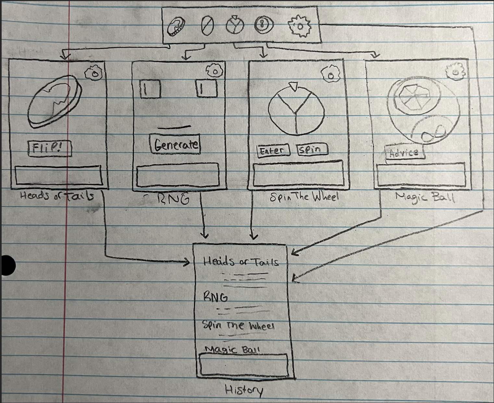
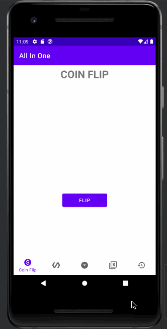
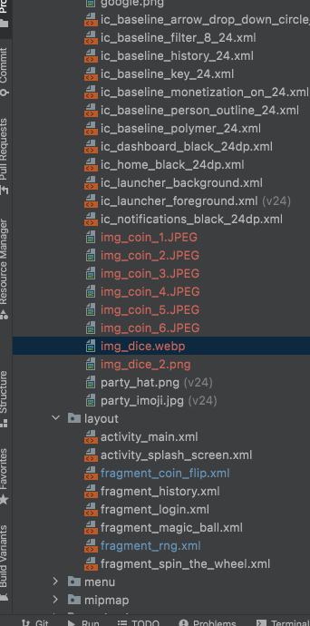

# Milestone 1 - All-In-One App
#### Group 1: Adrian Perez, David Martinez, Jonathan Martinez Valdez

## Table of Contents

1. [Overview](#Overview)
1. [Product Spec](#Product-Spec)
1. [Wireframes](#Wireframes)

## Overview

### Description

The All-In-One (Heads or Tails/Random Number Generator/Spin The Wheel/ Magic Ball) App contains decision-making methods for the user to utilize in order to make real life decisions easier. They are able to use any of these methods to get an answer and find out what they want to decide on if they want to leave it up to chance and randomness!

### App Evaluation

[Evaluation of your app across the following attributes]
- **Category:** Productivity
- **Mobile:** Creating this mobile app will allow the user to get an answer to their undecisive question in order to make the decision. The user is able to use this app anywhere they are at as long as they have the app on their phone!
- **Story:** Allows for a convinient way to produce a random outcome through various means.
- **Market:** This app is not restricted to any one group. Anyone can use this app to make and produce any decision.
- **Habit:** Allowing a computer to decide between options reduces the load of having to make decisions by yourself.
- **Scope:** V1 would allow users to use Heads-or-Tails, Random number generator and spin the wheel. V2 would introduce the magic ball. V3 would update the animations for all parts.

## Product Spec

### 1. User Features (Required and Optional)

**Required Features**

* User can use the Heads-or-Tails
* Random Number Generator
* Spin the Wheel
* Magic Ball
**Stretch Features**     

* Add animations to each method
* Users can have an "elimination" mode for each method
* Add another screen that displays stats

### 2. Screen Archetypes

- Heads-Or-Tails
  - User can interact with coin to flip and get one of two results
  
- RNG
  - User can interact with simplified GUI to produce a random number
  
- Spin The Wheel
  - User can spin a wheel to randomly choose between a multitude of options
  
- Magic Ball
  - User can interact with a 'Magic Ball' to give random advice
  
- History
  - User can preview a history of their randomly generated outcomes

### 3. Navigation

**Tab Navigation** (Tab to Screen)

* Heads-Or-Tails
* RNG
* Spin The Wheel
* Magic Ball
* History

**Flow Navigation** (Screen to Screen)

- Heads-Or-Tails
  - History
  
- RNG
  - History
  
- Spin the Wheel
  - History
  
-Magic Ball
  - History

## Wireframes

[Add picture of your hand sketched wireframes in this section]

## Week 1 Sprint

### Tasks:
- [x] Create Screen Fragments
- [x] Populate Screens with barebones elements (no customization yet)
- [x] Create Bottom Navigation
- [x] Connect Navigation to Screens

### gif of completed Week 1 progress:

------------------

## Week 2 Sprint

### Tasks:
- [x] complete algorithms for heads or tails and rng
- [x] implement the functions of screens heads or tails and rng
- [x] customize screens heads or tails and rng
- [x] create splash screen for app opening
- [x] create login screen for user

### gif of completed Week 2 progress:

### gif of last week progress
<ing src="./Sprint3.gif" width=500
